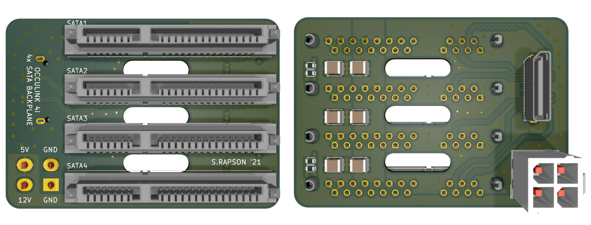
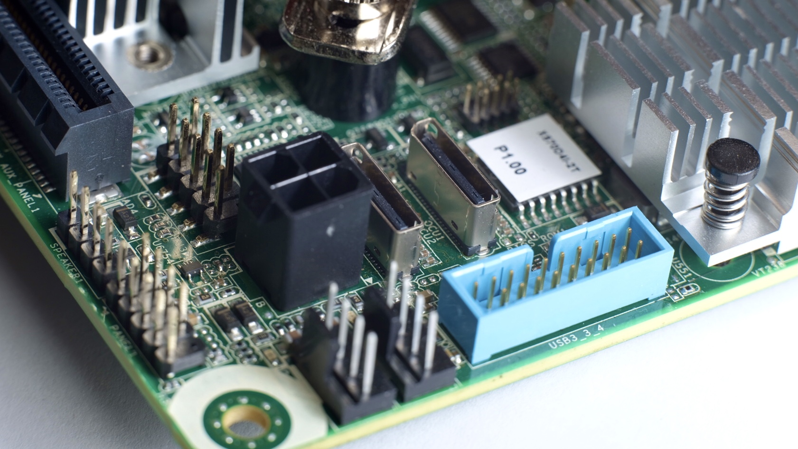

# Occulink 4i to 4x SATA Backplane

A quad 2.5in SATA 'backplane' which connects via SFF-8611 (Occulink).

Intended as a one-off to increase packaging density (and neaten wiring) for my SFF flash-storage server.

# Data

This board aims to behave in the same manner as the Occulink CBL-SAST-0933 cable which uses a SFF-8611 connector to break out 4x SATA 7-pin connectors.

On the Asrock Rack X570D4I-2T motherboard I'm using, the OCU1 and OCU2 connectors are connected via the chipset and can operate in PCIe4x4 or 4x SATA mode.

# Power

In some situations (mine) the motherboard provides a power connector.

I don't include 3.3V supply to the disks, as most manufacturers don't use it, and some re-use the 3.3V pins for out-of-spec functionality (looking at you WD).

This board matches the pinout with the same Molex MicroFit 4-pin connector. It's also really easy to create a custom loom from a modular powersupply.

